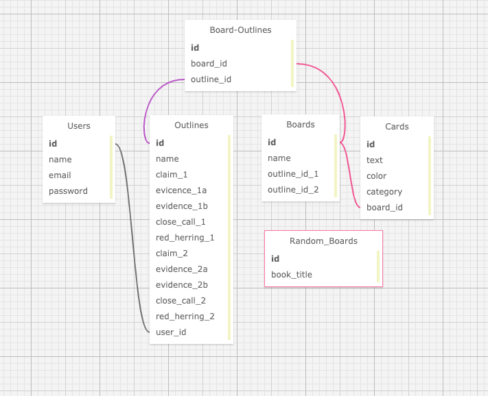

# Ahoy!: An outline rescue game  

_11 December 2020_

#### _An English language arts game for essay outlining_

#### By _**Vanessa Stewart**_

## Table of Contents
1. [Description]()

## Description

This is a capstone project for Epicodus. It is an English language arts game that intervenes during the essay outlining process. 

As a former English teacher, I remember how I wished I and my students could have had more time to spend on refining students' outlines. Too often I would look over their outlines quickly to ensure they at least had a solid thesis and claims and quotations to back that thesis up. We were not able to dig more deeply into whether the evidence selected for the paper was actually persuasive; this would cause problems later on during the drafting phase when students could not understand why arguments lacked strength. 

Ahoy! uses the power of collaboration, cognitive dissonance, and play to engage students in a critical examination of their outlines. Two students enter their outlines into the game, which randomizes their evidence in a game board. Each outliner gives a one sentence claim or clue to a partner to see if their partner can correctly guess the evidence the outliner selected to prove their claim. If a claim fails to work, the clue giver will have to improvise and craft and better claim. The team that selects all the evidence first wins!

## Minimum Viable Product User Stories
| #    | Story | 
| ---- | ----- | 
| 1 | As a user I can see options on the splash page for signing up, signing in, or playing. I can also see links for directions, about, learning theory, attributions, and contact details. |
| 2 | As a user, when I sign in, I can see all outlines created, read individual ones, create new ones, editing exisiting ones, and delete obsolete ones. |
| 3 | As a user, I can enter the ouline ids of two outlines and get a game board with the data from both outlines. |
| 4 | As a user, I can click on the game board cards to reveal what type of evidence the card contains and to which team it belongs. |
| 5 | As a user, I can win the game by selecting all my partner's evidence and see a win scenario with a prompt to return to my outlines or play again. |

## Stretch Goal Stories
| #    | Story | 
| ---- | ----- | 
| 1 | As a user, I can select 'random' button on the splash page, and get a game board generated by random quotes from the book that I select. |
| 2 | As a user, I can see a report of my games and/or complete a reflection sheet for my teacher. |
| 3 | As a teacher, I can add students to my classroom and see all of their outlines/reflections. |
| 4 | As a teacher, I can see a link on the splash page for getting sample reflection questions for students to pose to their teammates and to themsleves to guide improvements of their outline. |

## Database Tables Visualization

## Setup/Installation Requirements
**To View Project**
* Open a web browser of your choice and navigate to the following page: COMING SOON!

**To Extend Project**
1. Install Rails
- For this project, you will need Ruby. Follow the directions [here](https://www.learnhowtoprogram.com/ruby-and-rails/getting-started-with-ruby/ruby-installation-and-setup) for setting up Ruby.
- Install Rails on your machine with the following terminal command `gem install rails -v 5.2.0`

2. Clone Repo and Install Bundler
- Navigate to the directory on your local computer where you would like to clone this repo.
- Clone this repo using the `git clone https://github.com/vanmars/ahoy.git` command in terminal/command line.
- Navigate to the cloned folder `cd ahoy` and run `gem install bundler` to install Bundler, which will mange all gem installations for our project.
- Run `bundle` or `bundle install` in your command line to download all dependencies. (If you add additional gems later, you will need to run `bundle update <gem name>`.)

3. Set Up Database
- Run `rake db:setup` in the terminal. This is akin to running the following rake tasks all at once: db:create(creates the dev and test databases for the current env), db:schema:load (recreates the database from the schema.rb file), and db:seed (runs the db/seed.rb file).

4. Open in Text Editor
- Open the cloned repo in a text editor of your choice.
- To Run Tests: While in the root directory of this project, run `rspec` in your command line. If that command gives you trouble, run `bundle exec rspec`.
- To Run the App in Browser: While in the root directory of the project, run `rails s` in the terminal. This will start a server, which you can access by entering `localhost:3000` in your browser.

## Known Bugs

_No known bugs at this time._

## To Do
* Add content to about, contact, and directions pages
* Change game interaction, so that it remains player's turn if a yellow card is selected. Kepp it so that if a red card is selected, the player's turn changes.
* Add animations: loading wheel when api being called, clouds across home screen, ship to the rescue on win screen?
* Add music?

## Improvements
* Need error handling for when API call from random button does not work and when incorrect user id is entered on play button

## Support and Contact Details

_Connect with me at vamariestewart@gmail.com with ideas to improve this project._

## Technologies Used

* HTML
* CSS/Bootstrap
* JavaScript
* Ruby
* Rails

## Photo Credits

Splash Page: <a href="https://www.freepik.com/vectors/tree">Tree vector created by upklyak - www.freepik.com</a>